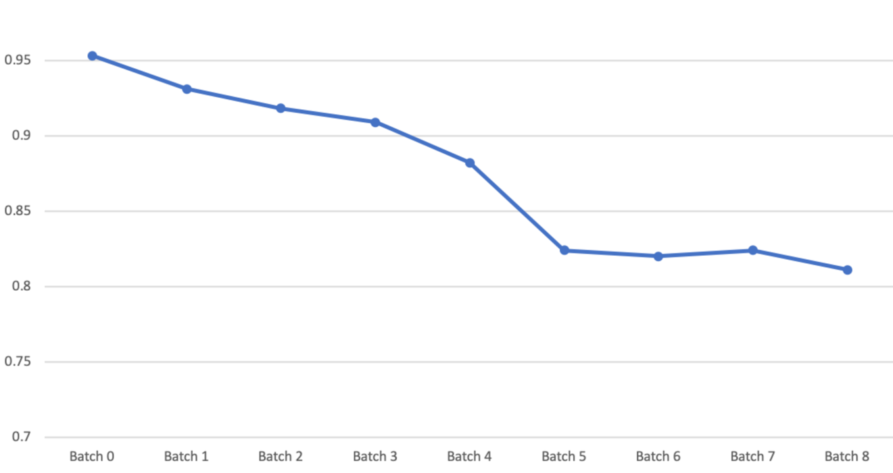
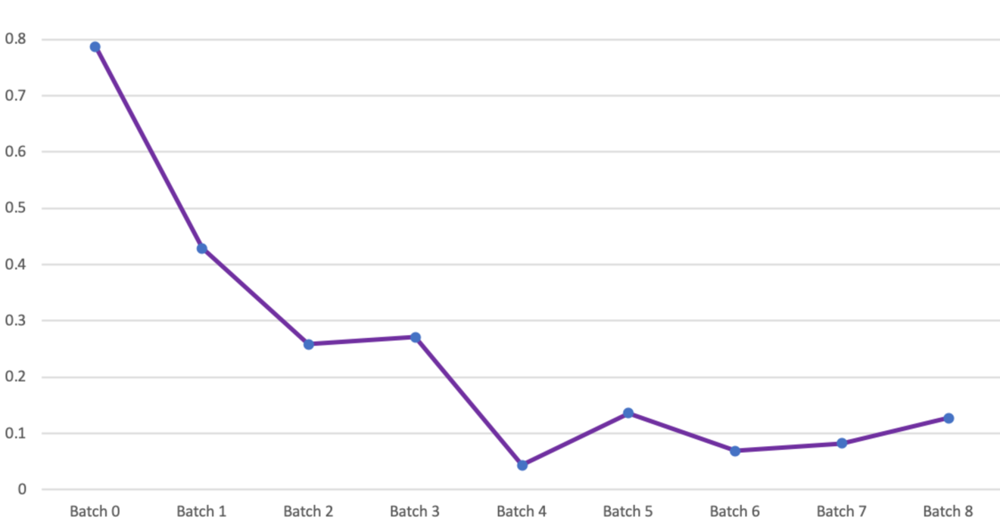
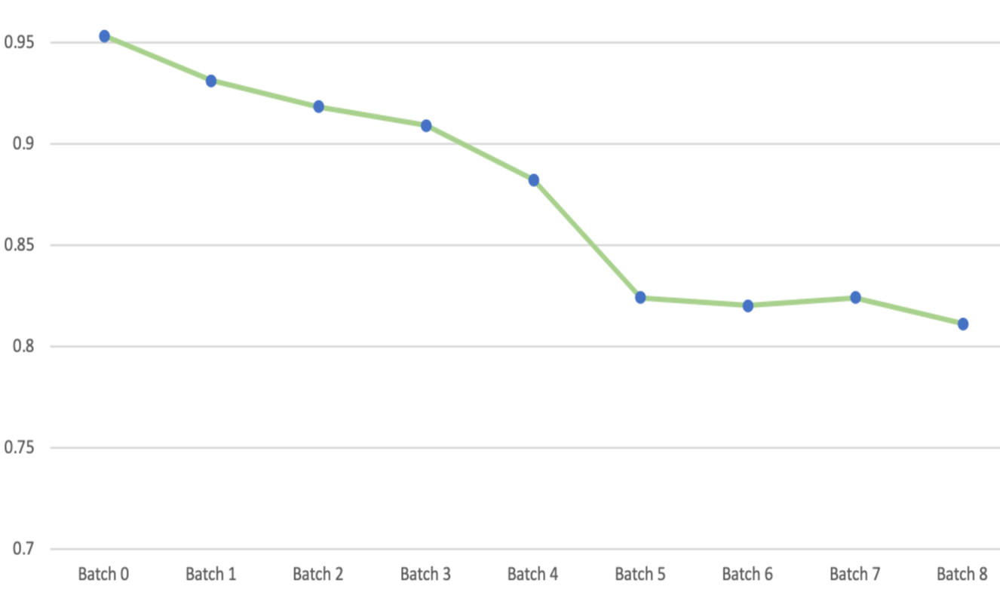
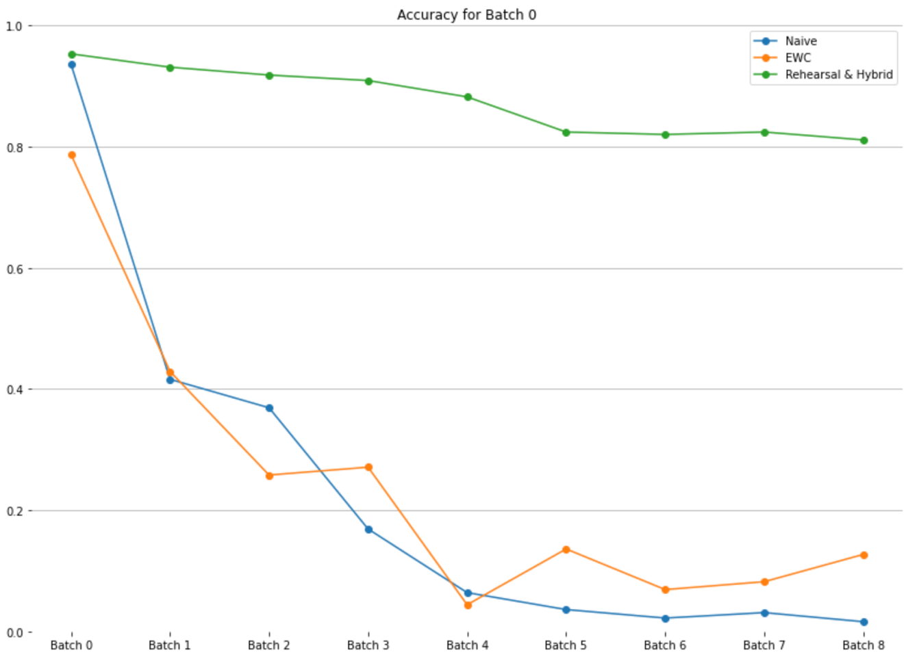
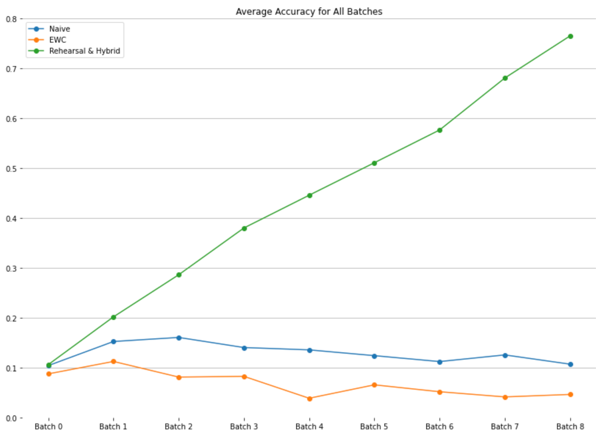

# Project report

**Member:** Haotian Ma

**Title:** Continual Learning Strategies

**Introduction:** 

Machine Learning algorithms are capable to learn individual task, but it is not enough for a more generalized AI agent to be effective. It needs to learn many tasks, which leads to a new area of AI research, Continual Learning, focused on the challenge of learning multiple tasks. Deep neural networks in naive CL are trained only on new data, they experience a rapid overriding of their weights with a phenomenon known in literature Catastrophic Forgetting. We want those models to keep a good performance on previous tasks after training new tasks, so we need some strategies to reduce Catastrophic Forgetting. 

Single-Incremental-Tasks (SIT) is the challenge to take on different tasks. New Classes (NC) is a subcategory of SIT. Continual Learning techniques is the ability to update the models by using only recent data. Many CL strategies have been developed to combat catastrophic forgetting. There are three types of strategies [4]: architectural, regularization and rehearsal. In this project, I mainly use elastic weight consolidation (EWC), a regularization strategy, and a rehearsal strategy, then I combine them.

The main base code is freely available from [here](https://github.com/Pervasive-AI-Lab/cvpr_clvision_challenge), I use them as the base and add some modifications to run for this project. My project Github link is <https://github.com/harveymht/dl-project>.

**Dataset (from reference 1):** 

CORe50, specifically designed for (C)ontinual (O)bject (Re)cognition, is a collection of 50 domestic objects belonging to 10 categories: plug adapters, mobile phones, scissors, light bulbs, cans, glasses, balls, markers, cups and remote controls. Classification can be performed at object level (50 classes) or at category level (10 classes). The full dataset consists of 164,866 128×128 RGB-D images: 11 sessions × 50 objects × (around 300) frames per session. Three of the eleven sessions (#3, #7 and #10) have been selected for test and the remaining 8 sessions are used for training.

Some examples of CORe50, from [1].

**Model:** 

ResNet18 neural network. The input is an image with size [3, 128, 128] and the output is a classification within 50 classes. I solely focused on CL techniques, not model building, so I use a pretrained model from PyTorch. Using the ResNet architecture has huge performance benefits in many deep learning applications. If we want to increase performance of a neural network, we can choose to add many layers, but it will prevent a signal from making through the network. In the ResNet, previous signal can skip ahead, and its strength can remain useful. In addition, research has shown the performance is equivalent to an ensemble of neural networks.

I use CrossEntropyLoss as the loss function and use SGD with learning rate 0.01 as the optimizer.

**Results:**

1) Rehearsal

The rehearsal strengthens the connection for memories already learned. In rehearsal, data from previous tasks is periodically appended to the training data for a new task.

Use [cl_rehearsal.py](https://github.com/harveymht/dl-project/blob/master/cl_rehearsal.py) to run.

In this project there are 9 batches(tasks) in the training process. In each batch I combine half of data of previous batches and all data of this batch to train. Here is the test accuracy on batch 0 after training each batch in incremental order.

Using more old data will increase the accuracy, but it will lead to high memory use and slow runtimes. Conversely, reducing the proportion of old data in each round of training will increase speed and efficiency, but give lower performance. I need to find the sweet spot which allows efficient use of memory and processing time with relatively good performance. After fine-tuning, the optimal number of old data per batch retained to use for next round is about 12,000.

1) Elastic Weight Consolidation

EWC is a regularization strategy in which the loss function as defined by

Lθ=LBθ+iλ2Fiθi-θA,i\*2

LBθ is the loss for task B only, F is the Fisher Information Matrix, λ is the importance of task A relative to task B.

Use [cl_ewc.py](https://github.com/harveymht/dl-project/blob/master/cl_ewc.py) to run.

In this project there are 9 batches(tasks) in the training process, and I set λ=4. In each batch I store the fisher matrix values and optimum weights for this task and accumulate all penalties of previous batches to the loss of this batch. Here is the test accuracy on batch 0 after training each batch in incremental order.

It requires more memory and runtimes. Maybe I can use a single penalty, not the accumulation of previous tasks, to reduce memory use and increase efficiency.

Using a single dictionary of fisher matrix values can still limit catastrophic forgetting and give a faster and more efficient performance.

1) Hybrid rehearsal with EWC

Combine rehearsal strategy with EWC to see if we can get some improvement. Half of the previous tasks' data is appended to the training data, and then use the train-net-ewc function to train this training data. 

Use [cl_hybrid.py](https://github.com/harveymht/dl-project/blob/master/cl_hybrid.py) to run.

Here is the test accuracy on batch 0 after training each batch in incremental order.

**Conclusion:**

Because the goal of continuous learning is to remember tasks over time, I only focus on the accuracy on batch 0. Plot below shows the batch 0 accuracy of all methods. And it tells us that rehearsal is the best strategy to maintain test accuracy over different batches. The hybrid strategy and rehearsal had almost identical performance. The EWC in the hybrid strategy suffered dramatically, so the hybrid method performed well solely because of rehearsal.

On the other hand, the overall accuracy of the model is also very important. Plot below shows the average accuracy for all batches. It tells us that the accuracy for naive and EWC do not increase, but rehearsal and the hybrid method can increase average accuracy.

In this project, I compared the three strategies and saw how they perform. I got some results and found a good strategy rehearsal, but it took much time to run. Then I combined it with EWC and generated a hybrid strategy, which needs less time to run while retaining the good performance as rehearsal.

**References:**

\1. [Lomonaco, 2017] Vincenzo Lomonaco and Davide Maltoni. "CORe50: a new Dataset and Benchmark for continual Object Recognition". Proceedings of the 1st Annual Conference on Robot Learning, PMLR 78:17-26, 2017.

\2. [Kirkpatrick, 2017] Kirkpatrick, James, et al. "Overcoming catastrophic forgetting in neural networks." arXiv:1612.00796v2 (2017).

\3. [Parisi, 2019] Parisi, German I., et al. "Continual lifelong learning with neural networks: A review." Neural Networks (2019).

\4. [Maltoni, 2019] Davide Maltoni & Vincenzo Lomonaco. "Continuous Learning in Single-Incremental-Task Scenarios." arXiv:1806.08568v3 (2019).

